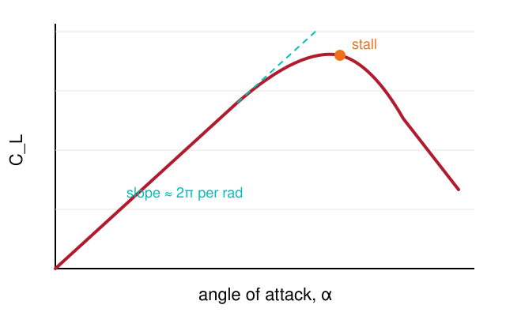

<!-- _class: title -->

# Lift, drag and the drag polar

## Lecture 3 · Aircraft Performance

Dr. A. Lecturer

<!--
Presenter notes go in HTML comments like this one. They show up in the
presenter view (press P in the HTML deck) and are stripped from PDF export.
-->

---

# Learning outcomes

By the end of this session you should be able to:

- State the lift and drag equations and identify every term
- Sketch a lift curve and explain what happens at the stall
  - Recognise the linear region and estimate its slope
  - Explain why the curve departs from linear
- Construct a drag polar from parasitic and induced components
- Use the polar to find the minimum-drag and minimum-power speeds

---

# The lift equation

Lift is the aerodynamic force normal to the free stream:

$$
L = \tfrac{1}{2}\,\rho\,V^{2}\,S\,C_L
$$

where $\rho$ is air density, $V$ is true airspeed, $S$ is the reference wing area and $C_L$ is the lift coefficient. In the linear region thin-aerofoil theory gives

$$
C_L \approx C_{L_0} + a\,\alpha, \qquad a = \frac{\partial C_L}{\partial \alpha} \approx 2\pi \ \text{per rad}
$$

> **Watch out.** $\alpha$ must be in radians when you use $2\pi$. Most data sheets quote degrees.

---

# The lift curve

<div class="columns">
<div>



<p class="caption">Lift coefficient against angle of attack for a cambered section.</p>

</div>
<div>

- **Linear region.** Slope close to $2\pi$ per radian for a thin section; finite wings reduce it.
- **Stall.** Flow separates from the upper surface and $C_L$ collapses.
- **Post-stall.** Highly unsteady. Avoid in analysis, avoid in flight.

</div>
</div>

---

<!-- _class: section -->

# Part 2

## The drag polar

---

# Parasitic and induced drag

| Component | Symbol | Scales with |
|---|---|---|
| Parasitic (profile + form) | $C_{D_0}$ | roughly constant with $\alpha$ |
| Induced (lift-dependent) | $k\,C_L^2$ | square of lift coefficient |
| Wave (compressible) | $C_{D_w}$ | Mach number above $M_{crit}$ |

Combined for a subsonic aircraft:

$$
C_D = C_{D_0} + k\,C_L^{2}, \qquad k = \frac{1}{\pi\,e\,AR}
$$

<div class="callout">
<strong>Minimum drag</strong> occurs where <span class="red">parasitic and induced drag are equal</span>, giving <em>C<sub>L</sub></em> = √(<em>C<sub>D0</sub></em>/<em>k</em>).
</div>

---

# Worked example in Python

```python
import numpy as np

rho, S = 1.225, 16.2          # kg/m^3, m^2
CD0, k = 0.025, 0.045
W = 9500.0                    # N

V = np.linspace(20, 80, 200)
CL = W / (0.5 * rho * V**2 * S)
CD = CD0 + k * CL**2
D = 0.5 * rho * V**2 * S * CD

print(f"Minimum drag {D.min():.0f} N at {V[D.argmin()]:.1f} m/s")
```

Try changing `k` and watch the minimum-drag speed move. Why does it move that way?

---

# Flight-test footage

<iframe width="960" height="480"
  src="https://www.youtube-nocookie.com/embed/VIDEO_ID"
  title="Stall demonstration" allowfullscreen></iframe>

<p class="caption">Replace <code>VIDEO_ID</code>. Iframes are blank in PDF export, so pair each with a linked poster image if you distribute PDFs.</p>

---

<!-- _class: blank-logo -->

# Picture with caption


<p class="caption">The blank-with-logo layout leaves the header band off for large figures.</p>

---

# Comparison

<div class="columns">
<div>

### Rectangular wing

- Simple to build
- Uniform section along the span
- Root stalls first, which is benign
- <span class="orange">Higher induced drag</span> at a given aspect ratio

</div>
<div>

### Elliptical wing

- Minimum induced drag for the span
- Span efficiency $e = 1$
- Whole span stalls together, which is <span class="red">not benign</span>
- Expensive to manufacture

</div>
</div>

---

<!-- _class: title-inverted -->

# Questions?

## your.email@bristol.ac.uk

Slides and notes are on the unit page
